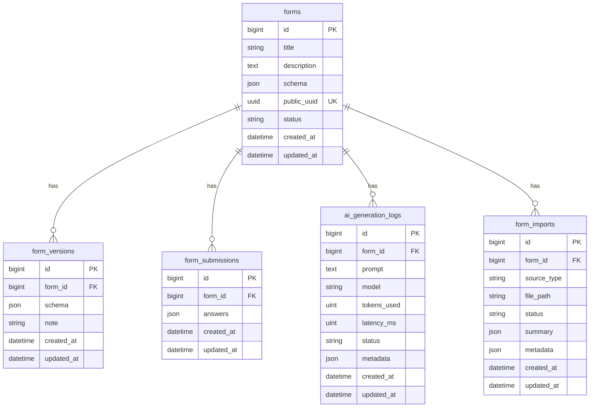

# FormForge AI

Laravel-based form builder with manual schema editing, public form links, submissions export, queued Gemini-powered form generation/editing, and document import entry points.

## Live Demo

- https://formforge-ai-production.up.railway.app/

## Setup Steps

### Local setup
1. Copy `.env.example` to `.env`.
2. Configure database credentials.
3. Install dependencies:
   - `composer install`
   - `npm install` (only if you are modifying frontend assets)
4. Generate app key: `php artisan key:generate`
5. Run migrations: `php artisan migrate --seed`
6. Start queue worker (required for AI generation): `php artisan queue:work --sleep=1 --tries=2 --timeout=120`
7. Start app: `php artisan serve`

### Railway / production setup
1. Set all required environment variables (see next section).
2. Run migrations on deploy: `php artisan migrate --force`
3. Run two processes:
   - Web process: serves Laravel app
   - Worker process: `php artisan queue:work --sleep=1 --tries=2 --timeout=120`
4. After env updates, clear cached config:
   - `php artisan optimize:clear`
   - `php artisan queue:restart`

Without a running worker, AI requests remain queued and frontend keeps polling `/ai/logs/{id}`.

## Environment Variables

### Required
- `APP_KEY`
- `APP_URL`
- `DB_CONNECTION`
- `DB_HOST`
- `DB_PORT`
- `DB_DATABASE`
- `DB_USERNAME`
- `DB_PASSWORD`
- `QUEUE_CONNECTION` (recommended: `database`)
- `GEMINI_API_KEY`

### Recommended AI settings
- `GEMINI_MODEL` (default: `gemini-2.5-flash`)
- `GEMINI_FALLBACK_MODELS` (comma-separated model list)
- `GEMINI_SSL_VERIFY` (`true` by default)
- `GEMINI_CA_BUNDLE` (optional custom CA path)

### Useful optional settings
- `APP_ENV`
- `APP_DEBUG`
- `LOG_CHANNEL`
- `SESSION_DRIVER`

## Architecture Overview

### Runtime components
1. Laravel web app for UI and API routes.
2. Database (forms, submissions, versions, AI logs, imports, jobs).
3. Queue worker to process AI schema generation jobs.
4. Gemini API for model inference.
5. File storage for imports and upload artifacts.

### High-level flow
1. User starts create/edit form in builder UI.
2. UI submits prompt to `POST /ai/generate`.
3. App creates `ai_generation_logs` row and dispatches `GenerateFormSchemaJob`.
4. UI polls `GET /ai/logs/{id}` until status becomes `completed` or `failed`.
5. Worker calls Gemini, normalizes and validates schema, applies fallback when necessary.
6. On edit mode, app snapshots previous schema in `form_versions` and updates `forms`.

## Schema / ERD Summary

### Core tables
- `forms`: form metadata and latest schema
- `form_versions`: historical schema snapshots
- `form_submissions`: submitted answers per form
- `ai_generation_logs`: queued/processing/completed/failed AI runs
- `form_imports`: uploaded import source tracking
- `jobs`, `failed_jobs`: queue infrastructure

### Relationship summary
- One `forms` row has many `form_versions` rows.
- One `forms` row has many `form_submissions` rows.
- One `forms` row can have many `ai_generation_logs` rows.
- One `forms` row can have many `form_imports` rows.

## API Endpoints

### Form routes
- `GET /` - Landing page.
- `GET /forms` - List forms.
- `GET /forms/create` - Open form builder.
- `POST /forms` - Create form.
- `GET /forms/{form}` - Show form and submissions.
- `GET /forms/{form}/edit` - Edit form in builder.
- `PUT /forms/{form}` - Update form.
- `GET /forms/{publicUuid}/fill` - Public fill page.
- `POST /forms/{publicUuid}/submit` - Submit public answers.
- `GET /forms/{form}/export?format=json|csv` - Export submissions.

### AI routes
- `POST /ai/generate`
  - Body: `{ prompt: string, form_id?: number }`
  - Behavior:
    - Returns `202` when a new job is queued.
    - Returns `200` with `reused=true` when an active identical request already exists.
- `GET /ai/logs/{log}`
  - Returns AI status payload including `status`, `schema`, `fallback_used`, `retry_errors`, and telemetry fields.

### Import route
- `POST /imports`
  - Accepts `.docx` or `.xlsx`
  - Creates imported form record and import log entry.

## AI Prompt Strategy

### Prompt contract
1. System prompt forces JSON-only output and fixed schema shape.
2. Allowed types are restricted to: `text`, `textarea`, `number`, `email`, `phone`, `date`, `file`, `rating`, `dropdown`, `radio`, `checkbox`, `heading`, `url`.
3. Edit mode includes existing schema in context so AI modifies instead of rebuilding from scratch.

### Reliability strategy
1. AI output is parsed from raw text and repaired when possible.
2. Schema is normalized (field types, keys, defaults, options).
3. Schema is validated before persist/use.
4. Retries run up to 2 attempts per candidate model.
5. If all attempts fail, deterministic fallback returns a valid schema.

### Model fallback strategy
1. Start from configured model (`GEMINI_MODEL`).
2. Merge configured fallback list and discovered generate-capable models.
3. Skip unavailable models quickly and continue to next candidate.

## Known Limitations

1. Queue worker is mandatory for non-sync AI flow; without it, UI keeps polling and AI appears stuck.
2. Import workflow currently seeds a basic placeholder schema; deep DOCX/XLSX semantic extraction is not implemented yet.
3. Fallback file storage path exists for form/submission resilience, which can diverge from database state if DB intermittently fails.
4. AI quality depends on model availability and provider-side latency/rate limits.
5. Current routes are demo-oriented and do not enforce auth/authorization boundaries.

## Notes for Operators

1. If AI works locally but not on Railway, verify worker process and env parity first.
2. For queue health checks, inspect `jobs`, `failed_jobs`, and app logs.
3. Restart workers after config/env changes: `php artisan queue:restart`.
